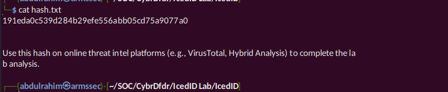
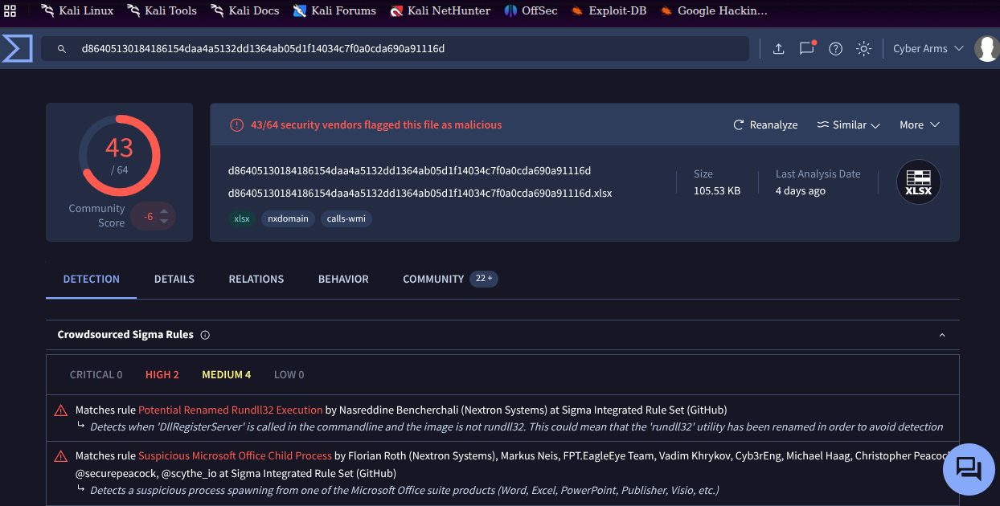
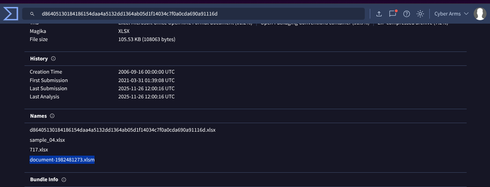
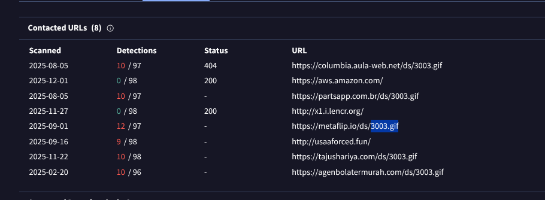
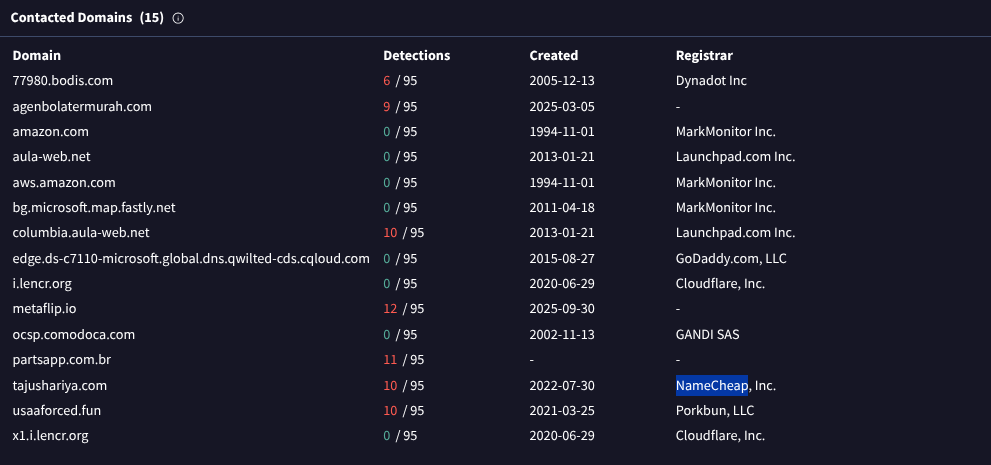
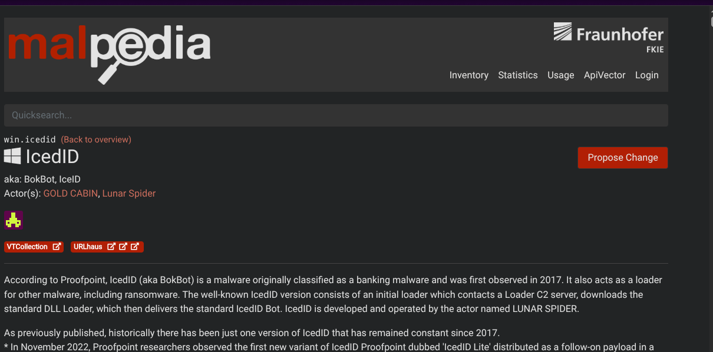
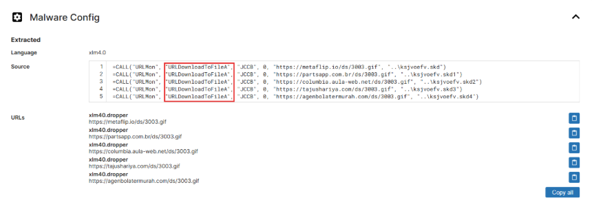

# ----------- IcedID Lab  ---------

## Overview

Investigate IcedID malware using VirusTotal and threat intelligence platforms to identify IOCs, associated threat actors, and execution mechanisms.

**Category:** Threat Intel  
**Tools:** VirusTotal, Malpedia, X, Tria.ge, ANY.RUN

## Scenario

A cyber threat group was identified conducting widespread phishing campaigns to distribute malicious payloads. IcedID was the most frequently encountered payload. You have been given a hash of an IcedID sample to analyze and monitor this advanced persistent threat (APT) group's activities.

## Lab Requirements

1. Download the lab file
2. Unzip the file to extract the hash for analysis

## Questions

## Qn. 1 What is the name of the file associated with the given hash?

let copy our file hash into virustotal for analysis,

Lets navigate to the DETAILS tab and we scroll way down to Name section in which we shall be able to see the name of the file associated with the given hash.

Answer:: document-1982481273.xlsm

## Qn. 2 Can you identify the filename of the GIF file that was deployed?

On our virustool dashboard lets navigate to the RELATIONS tab, let's us have a read on the different content in the relations tab sections (Contacted URLs , Dropped Files).
The file we're looking for is a .gif file, looking at the different contacted urls we noticed the content retrieved from the url,in this case which is our filename

Answer:: 3003.gif

## Qn. 3 How many domains does the malware look to download the additional payload file in Q2?

The domains we're looking for, that were used in the downloading of the additional payload of the .gif file, looking at the different contacted urls we noticed the content was retrieved from the 5 different urls.

Answer:: 5

## Qn.4 From the domains mentioned in Q3, a DNS registrar was predominantly used by the threat actor to host their harmful content, enabling the malware's functionality. Can you specify the Registrar INC?

Lets review the common registrars in the relations tab. Depending on your hash, the most used domain by the threat actor on my end with a registrar is NameCheap

Answer:: NameCheap

## Qn. 5 Could you specify the threat actor linked to the sample provided?

Using a threat intel framework like malpedia, after searching for IcedID, we find out the threat actor (Actor(s): GOLD CABIN, Lunar Spider) linked to the sample.

Answer:: GOLD CABIN

## Qn. 6 In the Execution phase, what function does the malware employ to fetch extra payloads onto the system?

Using Tria.ge tool : <https://tria.ge/210330-gbdr6k9jxx>, we will examine the execution phase for API function calls linked to file download behavior within the Malware Config section.

Answer::  URLDownloadToFileA

# --- CONGRATULATIONS ON COMPLETING THE LAB ---------

