#   ----------- Red Stealer Lab  ---------

Analyze a suspicious executable using VirusTotal and MalwareBazaar to extract IOCs, identify C2,infrastructure, MITRE ATT&CK techniques, and privilege escalation mechanisms.

#
Category:Threat Intel
Tactics:Execution,Persistence,Privilege Escalation, Defense Evasion, Discovery, Collection, Impact
Tools: Whois, VirusTotal, MalwareBazaar, ThreatFox, ANY.RUN

# Scenario

You are part of the Threat Intelligence team in the SOC (Security Operations Center). An executable file has been discovered on a colleague's computer, and it's suspected to be linked to a Command and Control (C2) server, indicating a potential malware infection.
Your task is to investigate this executable by analyzing its hash. The goal is to gather and analyze data beneficial to other SOC members, including the Incident Response team, to respond to this suspicious behavior efficiently.

# Lab Requirement;

Download the file to work with in this lab to answers the questions (tasks) at hand

lets unzip the file to get the hash we shall work with

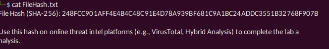

# Questions

# Qn.1 Categorizing malware enables a quicker and clearer understanding of its unique behaviors and attack vectors. What category has Microsoft identified for that malware in VirusTotal?

let copy our file hash into virustotal for analysis

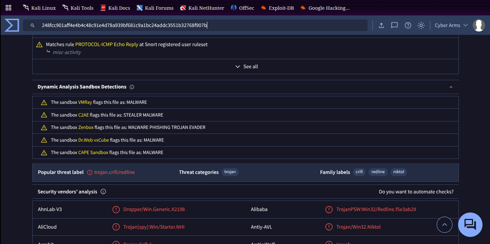

Answer:: trojan

# Qn.2 Clearly identifying the name of the malware file improves communication among the SOC team. What is the file name associated with this malware?

Note: Don’t include the file extension in the name.

After the hash search we can read and see the name we are looking for

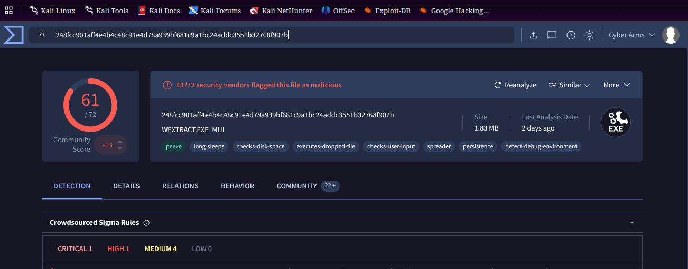

Answer:: wextract

# Qn.3 Knowing the exact timestamp of when the malware was first observed can help prioritize response actions. Newly detected malware may require urgent containment and eradication compared to older, well-documented threats. What is the UTC timestamp of the malware’s first submission to VirusTotal?

Lets navigate to the Details section and scroll down to history

Press enter or click to view image in full size

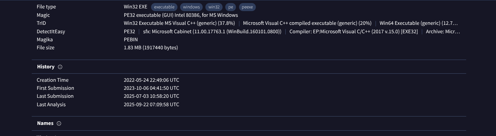

Answer:: 2023–10–06 04:41

# Qn.4 Understanding the techniques used by malware helps in strategic security planning. What is the MITRE ATT&CK technique ID for the malware’s data collection from the system before exfiltration?

Navigating to the Behavior Section under MITRE ATT&CK , under Collection

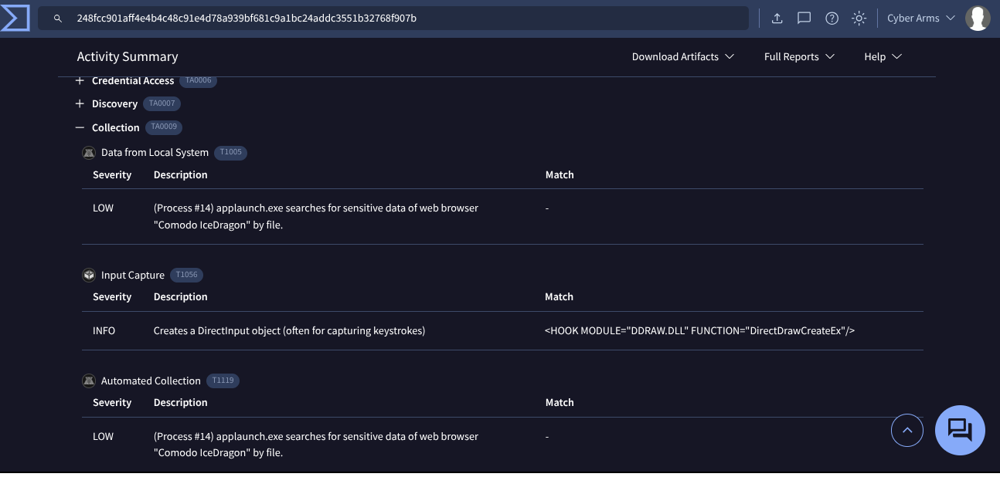

Answer:: T1005

# Qn. 5 Following execution, which social media-related domain names did the malware resolve via DNS queries?

Navigating to the Behavior Section and scrolling down to Network Communication. Reading through HTTP Requests and DNS Resolutions, we get to noticed the social media that was being connected to.

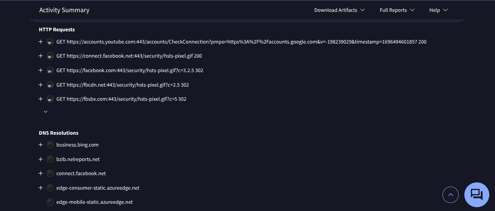

Answer:: facebook.com

# Qn. 6 Once the malicious IP addresses are identified, network security devices such as firewalls can be configured to block traffic to and from these addresses. Can you provide the IP address and destination port the malware communicates with?

Navigating to the Behavior Section, scrolling way down to Network Communication under IP Traffic

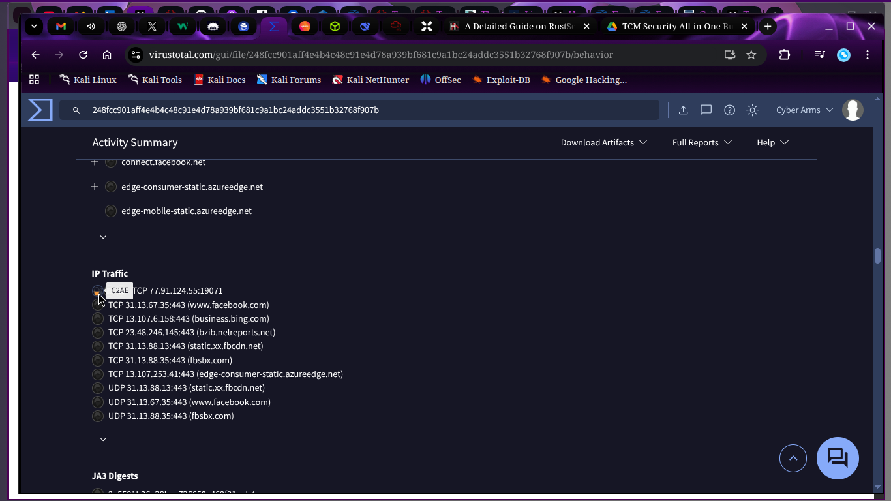

 # OR
if we check out the decoded texts

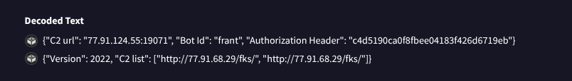

Answer:: 77.91.124.55:19071

# Qn . 7 YARA rules are designed to identify specific malware patterns and behaviors. Using MalwareBazaar, what’s the name of the YARA rule created by “Varp0s" that detects the identified malware?

Check for YARA rules related to the malware by searching on MalwareBazaar. These rules help identify and detect the malware based on its unique characteristics.

Lets paste ours hash in MalwareBazaar and do the analysis using the syntax below

" sha256:ourhash "

after tap the search button

Press enter or click to view image in full size

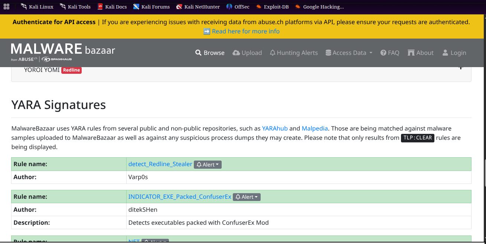

Answer:: detect_Redline_Stealer

# Qn.8 Understanding which malware families are targeting the organization helps in strategic security planning for the future and prioritizing resources based on the threat. Can you provide the different malware alias associated with the malicious IP address according to ThreatFox?

Doing a google search on redline stealer, we find out interesting info from one of the website called Malpedia

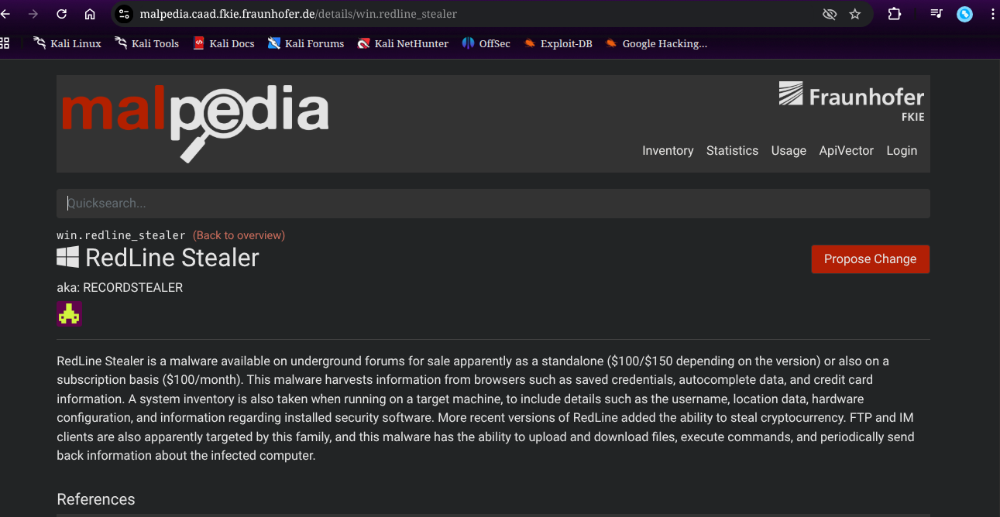

Answer:: RECORDSTEALER

# Qn. 9 By identifying the malware’s imported DLLs, we can configure security tools to monitor for the loading or unusual usage of these specific DLLs. Can you provide the DLL utilized by the malware for privilege escalation?

Navigating to details, under imports, also following the answer format plus the process under it,

we find out answer right there

Press enter or click to view image in full size

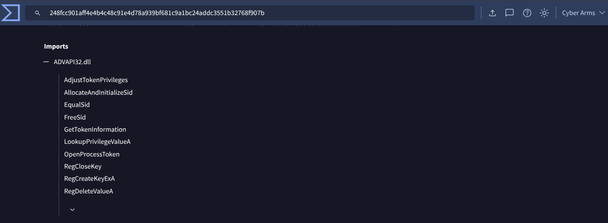

Answer:: ADVAPI32.dll

# Congratulations upon you completion of the lab.

