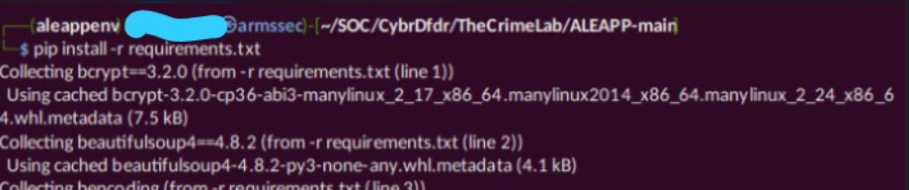
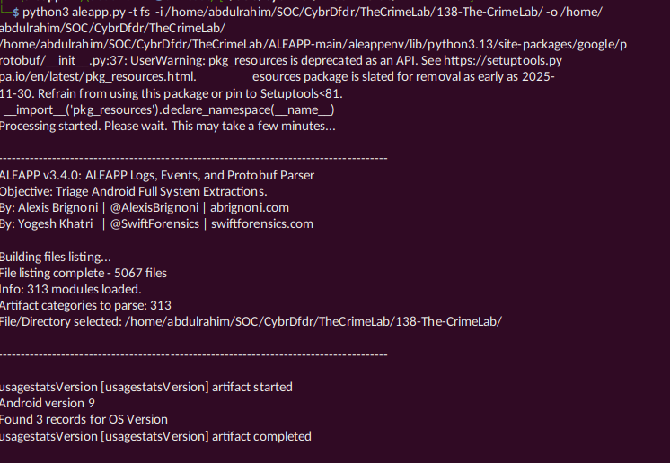
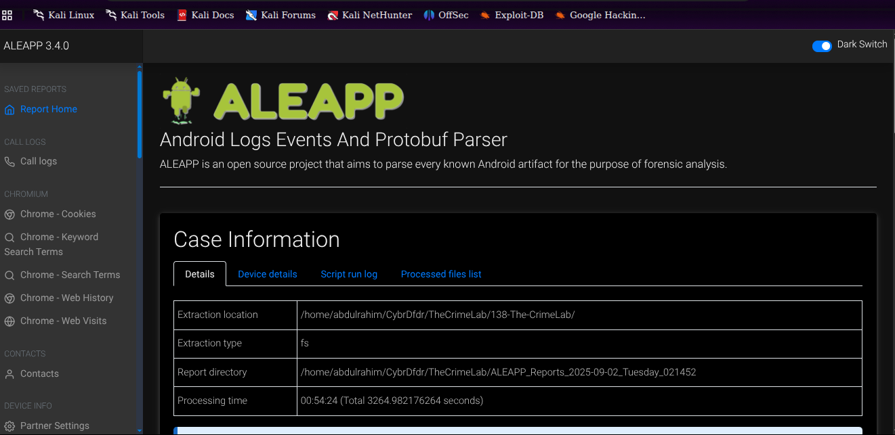
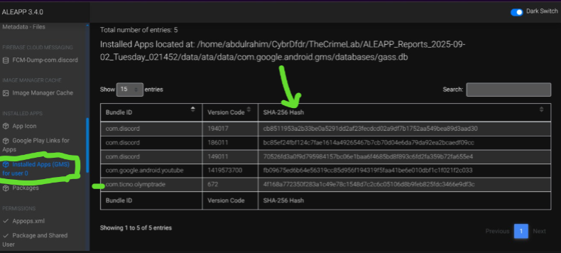
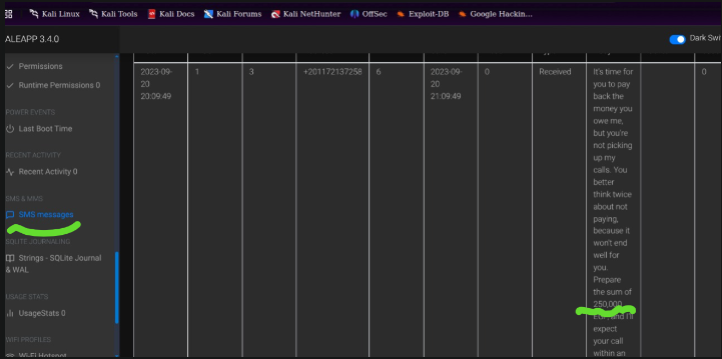
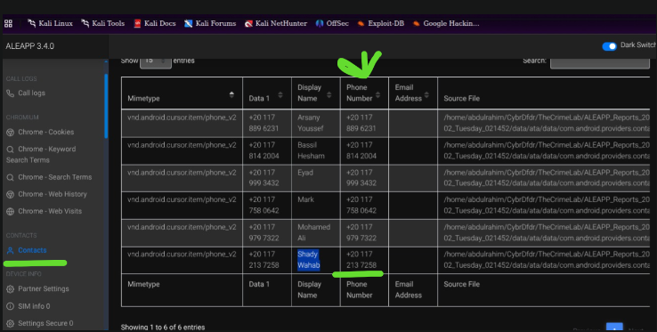
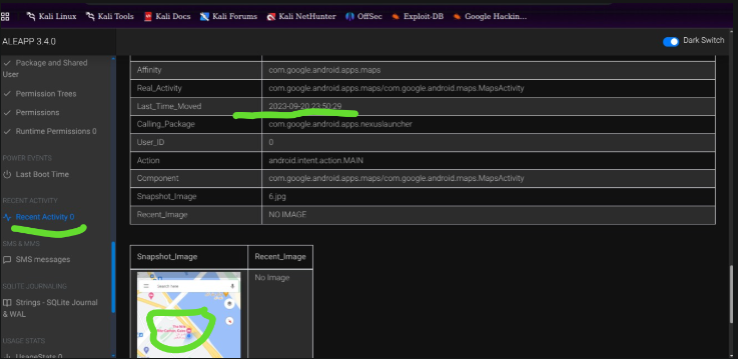
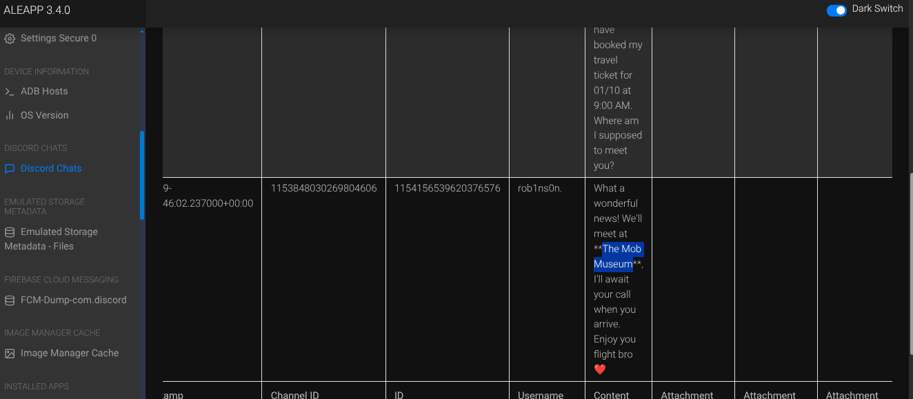

#         ------- THE CRIME LAB  ----------

Utilizing ALEAPP to analyze Android device artifacts, reconstructing a victim’s financial details, movements, and communication patterns.

Category: Endpoint Forensics

Tools: ALEAPP, DB Browser for SQLite.

# Scenario of the lab

We’re currently in the midst of a murder investigation, and we’ve obtained the victim’s phone as a key piece of evidence. After conducting interviews with witnesses and those in the victim’s inner circle, your objective is to meticulously analyze the information we’ve gathered and diligently trace the evidence to piece together the sequence of events leading up to the incident.s

# Watch outs within the lab 
Within this Lab we have 6/6 questions to answer as we elevate our skills to the next level in analyzing Android device artifacts.
So with that said lets dive into this awesome lab.

### But first download the downloadable Lab file we are supposed to work with folks

TIP: CyberDefenders has hints to questions you will be attempting so feel free to check them out in case you get lost along the way, their are there to guide you, YES you .:)

# Lets first install the ALEAPP app plus all its dependencies on our system that help us in analysis. This tool is particularly useful in reconstructing a device’s state and understanding the behavior of its user.

I like running commands, so in reconstructing the device’s state we shall use this command.

syntax: python aleapp.py -t <zip | tar | fs | gz> -i <path_to_extraction> -o <path_for_report_output>

-t specifies the format under which the file to reconstruct the device are in .zip, .tar, or just a folder fs or gz specify here accordingly

-i location to a file to used to contraction the device from

-o path to keep your file after construction

# Lets start off after a successful tool installation. 

## Qn 1. Based on the accounts of the witnesses and individuals close to the victim, it has become clear that the victim was interested in trading. This has led him to invest all of his money and acquire debt. Can you identify the SHA256 of the trading application the victim primarily used on his phone?

Lets reconstruct the victim’s device. Since my Lab files were extracted and are now stored as a folder on my local machine hence using this command

python3 aleapp.py -t fs -i /home/abdulrahim/SOC/CybrDfdr/TheCrimeLab/138-The-CrimeLab/ -o /home/abdulrahim/SOC/CybrDfdr/TheCrimeLab/

Time for Coffee Break !! As we wait the Device to be reconstructed which may take a couple of time.

After successful reconstruction we shall have a folder created under which which shall have the dashboard to the reconstructed device artifacts.

The trading App is identified as com.ticno.olymptrade, under InstalledApp

Answer:: 4f168a772350f283a1c49e78c1548d7c2c6c05106d8b9feb825fdc3466e9df3c

# Qn 2. According to the testimony of the victim’s best friend, he said, “While we were together, my friend got several calls he avoided. He said he owed the caller a lot of money but couldn't repay now". How much does the victim owe this person?

Lets scroll down to SMS to look through SMS and see if we shall get the figure we want

Answer:: 250,000

# Qn.3 What is the name of the person to whom the victim owes money?

Lets navigate to the contacts section and get to see the contact that messaged the victim and get to know how he saved the sender

Answer:: Shady Wahab

# Qn 4. Based on the statement from the victim’s family, they said that on September 20, 2023, he departed from his residence without informing anyone of his destination. Where was the victim located at that moment?

To answer this we shall look out on the recent activities of the victim probably GPS/ Google maps etc under “ Application: com.google.android.apps.maps “ we get am image that may have the information that we are looking for.

Answer:: The Nile Ritz-Carlton

# Qn 5. The detective continued his investigation by questioning the hotel lobby. She informed him that the victim had reserved the room for 10 days and had a flight scheduled thereafter. The investigator believes that the victim may have stored his ticket information on his phone. Look for where the victim intended to travel.

If the victim had reserved a room for 10 days that means he was send infomation about his reversation in SMS or using other means Discord platform, lets check out the victims SMS.

We that the victim tended to go to The Mob Museum and from our searching this museum in located in Las Vegas

Answer:: Las Vegas

# Qn 6. After examining the victim’s Discord conversations, we discovered he had arranged to meet a friend at a specific location. Can you determine where this meeting was supposed to occur?

Answer:: The Mob Museum

## Congratulations you made this far .:)
At this moment you made it through, you gained the skills you deverse..

