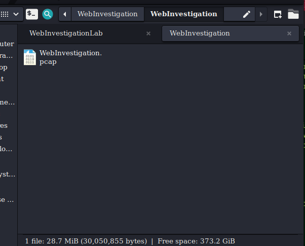
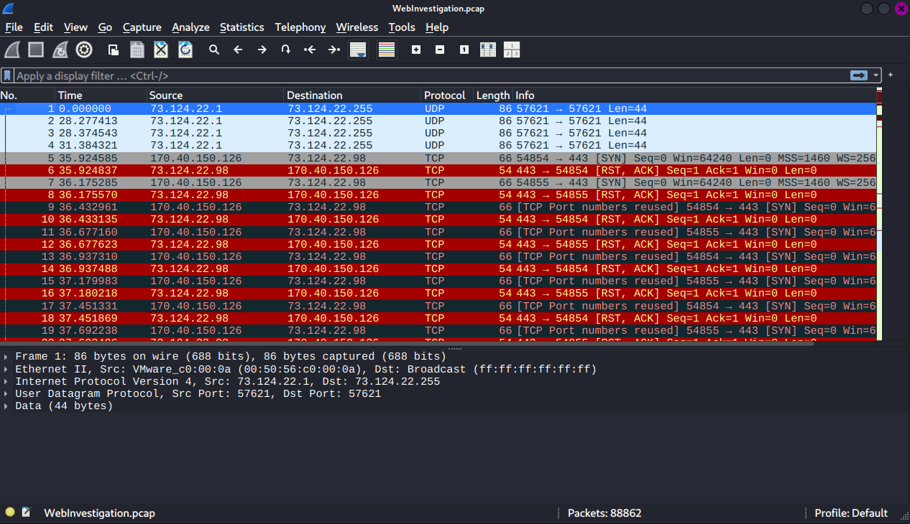
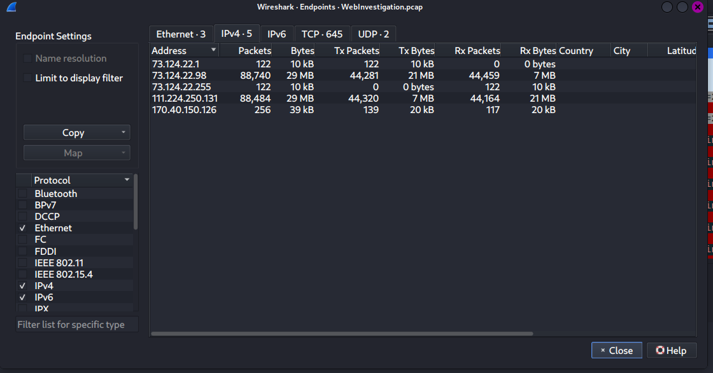
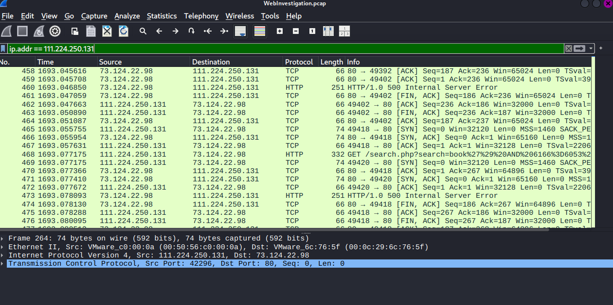
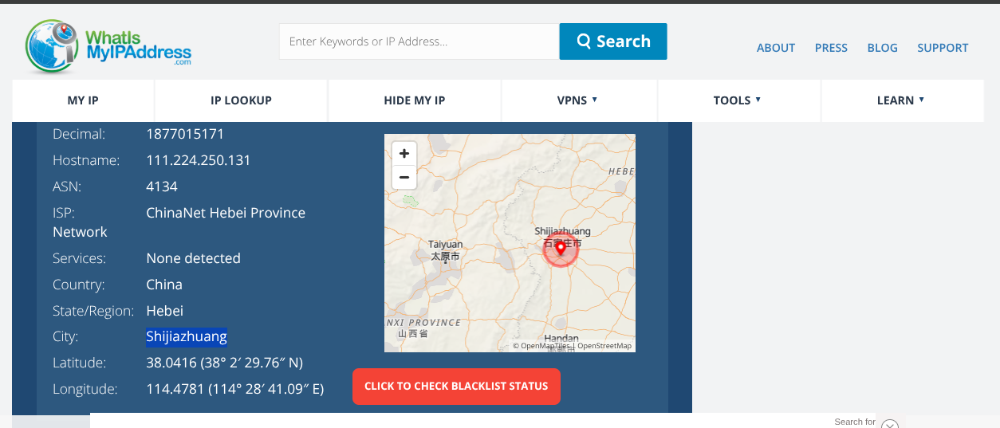
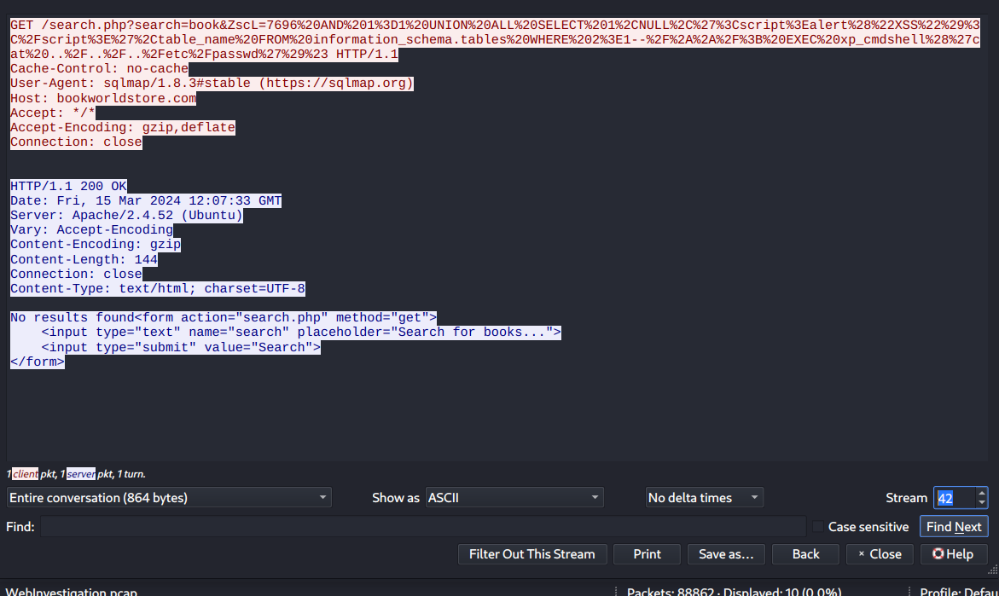

# ----------- WebInvestigation Lab  ---------

## Overview

Examine network traffic with Wireshark to investigate web server compromise, identify SQL injection, extract attacker credentials, and detect uploaded malware.

**Category:** Network Forensics
**Tactics:** InitialAcess, Persistence, Command and Control
**Tools:** Wireshark, Network Miner.

## Scenario

You are a cybersecurity analyst working in the Security Operations Center (SOC) of BookWorld, an expansive online bookstore renowned for its vast selection of literature. BookWorld prides itself on providing a seamless and secure shopping experience for book enthusiasts around the globe. Recently, you've been tasked with reinforcing the company's cybersecurity posture, monitoring network traffic, and ensuring that the digital environment remains safe from threats.
Late one evening, an automated alert is triggered by an unusual spike in database queries and server resource usage, indicating potential malicious activity. This anomaly raises concerns about the integrity of BookWorld's customer data and internal systems, prompting an immediate and thorough investigation.
As the lead analyst in this case, you are required to analyze the network traffic to uncover the nature of the suspicious activity. Your objectives include identifying the attack vector, assessing the scope of any potential data breach, and determining if the attacker gained further access to BookWorld's internal systems.

## Lab Requirements

Pro tip. For a safe experience, consider opening this content in a secure, isolated environment.

1. Download the lab file
2. Unzip the file to extract the pcap file for analysis

## Questions

## Qn. 1 By knowing the attacker's IP, we can analyze all logs and actions related to that IP and determine the extent of the attack, the duration of the attack, and the techniques used. Can you provide the attacker's IP?

After extracting the zipped file to get the pcap file lets open it and get started with the analysis.

Lets get to know the statistics of the pcap we are working with, end devices involved in the traffic got.
Under Statistics tab > EndPoints then change it to ipv4, we observe the devices involved with their packets respectively.

Two of the ips caught our attentions of the packets they had 29MBs.
Adding filters on these ips to get to know the attacker's ip.
Applying ip.addr == 111.224.250.131 , we get to see some info on certain protocols that picked out attention.

Answer:: 111.224.250.131

## Qn. 2 If the geographical origin of an IP address is known to be from a region that has no business or expected traffic with our network, this can be an indicator of a targeted attack. Can you determine the origin city of the attacker?

Using a web browser to get information (Geolocation) about the IP from which we shall get to know the region of our attacker IP.

Answer:: Shijiazhuang

## Qn. 3 Identifying the exploited script allows security teams to understand exactly which vulnerability was used in the attack. This knowledge is critical for finding the appropriate patch or workaround to close the security gap and prevent future exploitation. Can you provide the vulnerable PHP script name?

we see admin.php,search.php,login.php,xsql.php,wp-load.php, wifi.php etc.

But search.php caught our attention due to its encoding within the url.

## Qn. 4 Establishing the timeline of an attack, starting from the initial exploitation attempt, what is the complete request URI of the first SQLi attempt by the attacker?

